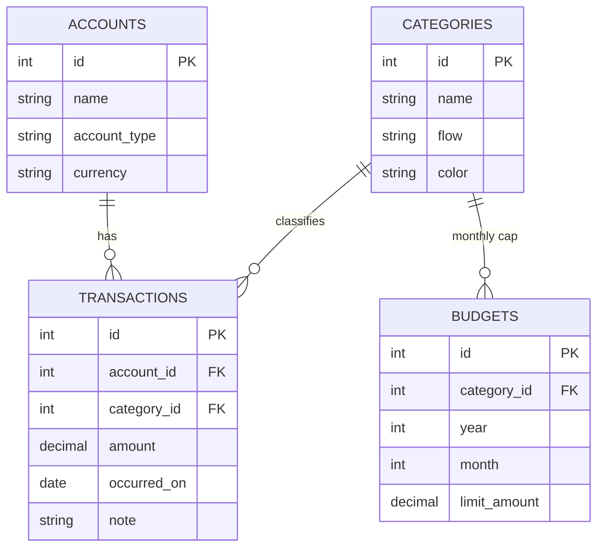

# Personal finance & expense tracker

Full-stack **personal ledger**: **SQLite** (embedded relational DB), **Flask** REST API, **React** (Vite) UI with **Tailwind CSS**.

## Architecture

| Layer        | Role |
| ------------ | ---- |
| **SQLite**   | Single-file database under `backend/instance/finance.db`; ACID transactions, foreign keys, indexes for date/account filters. |
| **Flask**    | JSON API under `/api/*`; SQLAlchemy ORM maps to the same tables as `docs/schema.sql`. |
| **React**    | SPA: dashboard, transaction list + form, accounts, categories, monthly budgets. |
| **Vite**     | Dev server proxies `/api` → Flask (`127.0.0.1:5000`) so the browser has no CORS friction in development. |

### Entity relationship (conceptual)



### Domain rules

- **Amounts** are stored as positive decimals. Whether a row is **income** or **expense** is determined by the linked **category’s `flow`** (`income` vs `expense`).
- **Account balance** (summary endpoint) is a signed aggregate: income adds, expenses subtract (all time, per account).
- **Budgets** are per **expense category** and **calendar month**; `category_id + year + month` is unique.

## API (high level)

| Method | Path | Purpose |
| ------ | ---- | ------- |
| GET/POST | `/api/accounts` | List / create accounts |
| PATCH/DELETE | `/api/accounts/<id>` | Update / delete |
| GET/POST | `/api/categories` | List (`?flow=income|expense`) / create |
| GET/POST | `/api/transactions` | List (filters: `from`, `to`, `account_id`, `category_id`) / create |
| DELETE | `/api/transactions/<id>` | Remove row |
| GET/POST | `/api/budgets` | List by `year`/`month` / upsert budget |
| DELETE | `/api/budgets/<id>` | Remove budget |
| GET | `/api/summary/month` | Month totals + breakdown by category |
| GET | `/api/summary/account-balances` | Per-account net balance |

On first startup, the API seeds **default categories** and one **checking account** if tables are empty.

## Run locally

**Terminal 1 — backend**

```bash
cd backend
python -m venv .venv
.\.venv\Scripts\activate
pip install -r requirements.txt
python run.py
```

API: `http://127.0.0.1:5000/api/accounts`

**Terminal 2 — frontend**

```bash
cd frontend
npm install
npm run dev
```

UI: `http://127.0.0.1:5173` (Vite proxies `/api` to Flask).

## Production notes (short)

- Serve the React `npm run build` static files from Flask, **or** put both behind nginx with `/api` routed to gunicorn/uWSGI.
- Set `DATABASE_URL` if you move off the default SQLite path.
- Add authentication (sessions or JWT) before exposing on a public network; the scaffold is single-user.

## Project layout

```
backend/
  app/           Flask application package
  run.py         `python run.py` → debug server
  requirements.txt
frontend/
  src/           React components + `api.js`
  vite.config.js # dev proxy to Flask
docs/
  schema.sql     Reference DDL (matches ORM intent)
```

## Extensions (course / portfolio ideas)

- **Recurring transactions** (schedule table + job).
- **Tags** many-to-many with transactions.
- **CSV import** / bank OFX.
- **SQL views** for monthly rollups; **triggers** to enforce invariants in SQLite.
- **Row-level security** via proper multi-user schema + auth.
